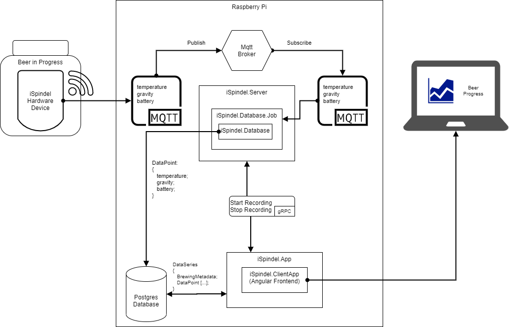

# iSpindel BrewManagement Interface

This project is a management interface to collect and visualize the data of the [iSpindel Hardware project](https://www.ispindel.de). The hardware project is a tube with sensors and wireless lan, which monitors the relevant figures of a fermenting beer mash and sends it to an mqtt broker.

The brew management interface adds some infrastructre around it:
- to grab the sensor data from mqtt
- save it into a database
- provide the user with a webfrontend to watch the development of the fermenting mash and save additional metadata of the brewing process with the data

## Architecture Overview

The iSpindel Hardware sends data to an mqtt broker. The _iSpindel.Server_ Project handles the capture of the data from the mqtt broker and the recording of a brewing process. A recording of a batch of data from a fermentation session is called a *DataSeries*. It is captured by the _iSpindel.Database.Job_ Class and persisted into a Postgres database by the _iSpindel.Database_ Class. iSpindel.Server handles the communication to the Webapplication _iSpindel.App_. The Webapplication handles the communication with the user. It presents an Angular Webfronted _iSpindel.ClientApp_, which enables the user to start recording values and enter related data and notes for a fermentation process. iSpindel.App sends recording requests to iSpindel.Server via the gRPC protocol and contacts the Postgres database to get information about past brewing sessions.